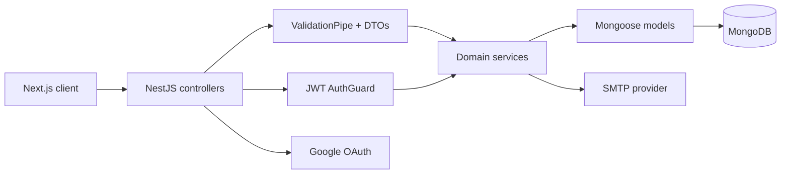

<div align="center">

# Finance API

**The authentication, budgeting, transaction, savings, and persistence layer behind Finance.**

[](https://nestjs.com/)
[](https://www.typescriptlang.org/)
[](https://www.mongodb.com/)
[](https://jestjs.io/)

[Frontend repository](https://github.com/bohdanhora/finance-front) · [Live application](https://finance-front-zeta.vercel.app/)

</div>

## Overview

Finance API is a NestJS REST service for a personal finance platform. It owns user identity, monthly budget state, transaction history, essential payments, savings goals and operations, currency migration, and daily activity streaks.

MongoDB provides persistence through Mongoose. Requests are validated globally with strict DTO whitelisting, and private resources are protected by JWT Bearer authentication.

## Core capabilities

- **Local and Google authentication** - registration with email verification, password login, Google OAuth 2.0, access-token renewal, logout, password changes, and password recovery.
- **Token lifecycle** - short-lived signed access tokens and rotating opaque refresh tokens persisted per user.
- **Budget management** - current balance, income and spending totals, next-month planning, savings percentage, and automatic month rollover.
- **Transactions** - validated income and expense creation, editing, deletion, categorization, and balance recalculation.
- **Essential payments** - reusable defaults, current- and next-month lists, payment state, and linked expense records.
- **Savings** - goals, target dates, deposits, withdrawals, cash/card transfers, purchase deductions, and optional main-balance synchronization.
- **Currency migration** - persisted UAH, USD, or EUR preference with server-side conversion of financial data.
- **Activity streaks** - current and best streaks, visit history, and celebrated milestones stored with the account.
- **Transactional email** - verification codes and password-reset links delivered through SMTP.
- **Defensive input handling** - `class-validator` DTOs, unknown-field rejection, ObjectId checks, and user-scoped database access.

## Tech stack

| Area | Technology |
| --- | --- |
| Runtime framework | NestJS 11, Node.js, TypeScript |
| Database | MongoDB, Mongoose |
| Authentication | JWT, Passport, Google OAuth 2.0, bcrypt |
| Validation | class-validator, class-transformer |
| Email and templates | Nodemailer, Handlebars |
| Testing | Jest, ts-jest |
| Configuration | `@nestjs/config` |

## Architecture



The codebase is organized around two domain modules:

- `auth` manages users, credentials, OAuth, refresh/reset tokens, and account bootstrap;
- `transactions` manages the complete financial workspace and its calculations.

Shared guards, configuration, mail delivery, templates, and cross-cutting helpers remain outside those modules.

## Getting started

### Prerequisites

- Node.js 20 or newer
- npm
- MongoDB, either local or hosted
- SMTP credentials for email verification and password recovery
- Google OAuth credentials if Google sign-in is required

### Installation

```bash
git clone https://github.com/bohdanhora/finance-backend.git
cd finance-backend
npm ci
cp .env.example .env
npm run dev
```

On Windows PowerShell, use `Copy-Item .env.example .env` instead of `cp`.

The API starts at [http://localhost:8000](http://localhost:8000) by default. Configure the frontend with `NEXT_PUBLIC_API_URL=http://localhost:8000`.

## Environment variables

### Application and database

| Variable | Default | Description |
| --- | --- | --- |
| `PORT` | `8000` | HTTP port used by NestJS. |
| `FRONTEND_URL` | Production frontend | Destination used after a successful Google OAuth callback. |
| `MONGO_URL` | - | MongoDB connection string. Required. |

### Authentication

| Variable | Default | Description |
| --- | --- | --- |
| `JWT_SECRET` | - | Secret used to sign and verify access tokens. Required. |
| `JWT_ACCESS_TOKEN_TTL` | `1h` | Access-token lifetime accepted by `jsonwebtoken`. |
| `JWT_REFRESH_TOKEN_TTL_DAYS` | `3` | Refresh-token lifetime in days. |
| `GOOGLE_CLIENT_ID` | - | Google OAuth client ID. |
| `GOOGLE_CLIENT_SECRET` | - | Google OAuth client secret. |
| `GOOGLE_CALLBACK_URL` | - | OAuth redirect URI, for example `http://localhost:8000/auth/google/redirect`. |

### Email

| Variable | Default | Description |
| --- | --- | --- |
| `NODEMAILER_HOST` | - | SMTP server hostname. |
| `NODEMAILER_PORT` | - | SMTP server port, commonly `587`. |
| `NODEMAILER_USER` | - | SMTP username. |
| `NODEMAILER_PASS` | - | SMTP password or provider-specific app password. |

### Optional test account

| Variable | Default | Description |
| --- | --- | --- |
| `TEST_ACCOUNT_ENABLED` | `true` | Seeds a shared account when the application starts. |
| `TEST_ACCOUNT_NAME` | `admin` | Seeded account display name. |
| `TEST_ACCOUNT_EMAIL` | `admin@admin.com` | Seeded account email. |
| `TEST_ACCOUNT_PASSWORD` | `ChangeMe123` | Seeded account password. |

Set `TEST_ACCOUNT_ENABLED=false` outside controlled demo environments. If the account is enabled, always replace the default credentials.

## Authentication contract

Successful local login and token refresh return:

```json
{
  "accessToken": "<signed JWT>",
  "refreshToken": "<opaque token>",
  "userId": "<MongoDB ObjectId>"
}
```

Send the access token to protected routes with:

```http
Authorization: Bearer <accessToken>
```

Refresh tokens are stored in MongoDB and replaced when a new token pair is issued. Google OAuth starts at `GET /auth/google`; after the callback, the API redirects to the configured frontend login page with the issued credentials.

## API overview

### Authentication routes

| Method | Route | Purpose | Access |
| --- | --- | --- | --- |
| `POST` | `/auth/request-email-code` | Send a registration verification code. | Public |
| `POST` | `/auth/registration` | Create a verified local account. | Public |
| `POST` | `/auth/login` | Authenticate with email and password. | Public |
| `POST` | `/auth/refresh` | Exchange a refresh token for a new token pair. | Public |
| `POST` | `/auth/logout` | Revoke the stored refresh token. | Public |
| `PUT` | `/auth/change-password` | Change the authenticated user's password. | Bearer token |
| `POST` | `/auth/forgot-password` | Send a password-reset link when the account exists. | Public |
| `PUT` | `/auth/reset-password` | Reset a password with a valid reset token. | Public |
| `GET` | `/auth/google` | Start Google OAuth. | Public |
| `GET` | `/auth/google/redirect` | Handle Google's OAuth callback. | Google OAuth |

### Finance routes

Every `/transactions/*` route requires a valid Bearer token.

| Area | Routes |
| --- | --- |
| Workspace | `GET /all-info`, `POST /set-total`, `POST /set-next-month-total`, `POST /percent`, `POST /clear-all` |
| Transactions | `POST /new-transaction`, `PUT /update-transaction`, `POST /delete-transaction` |
| Currency | `PUT /currency` |
| Essentials | `PUT /set-essential-payments`, `PUT /set-checked-essential-payments`, `POST /new-essential`, `PUT /update-essential`, `PUT /remove-essential` |
| Savings goals | `POST /savings/goals`, `PUT /savings/goals`, `DELETE /savings/goals/:id` |
| Savings operations | `POST /savings/operations`, `DELETE /savings/operations/:id` |
| Streaks | `POST /streak/visit` |

Routes in this table are relative to `/transactions`.

## Available scripts

| Command | Description |
| --- | --- |
| `npm run dev` | Start NestJS in watch mode. |
| `npm run build` | Compile the application into `dist/`. |
| `npm start` | Start the application through the Nest CLI. |
| `npm run start:debug` | Start watch mode with the debugger enabled. |
| `npm run start:prod` | Run the compiled production entry point. |
| `npm test` | Run all Jest unit tests. |
| `npm run test:watch` | Re-run tests as files change. |
| `npm run test:cov` | Generate a coverage report. |
| `npm run lint` | Run ESLint against source and test paths. |
| `npm run format` | Format source and test TypeScript files. |

## Project structure

```text
finance-backend/
└── src/
    ├── auth/             # Auth controller, service, DTOs, schemas, OAuth
    ├── config/           # Typed environment configuration mapping
    ├── guards/           # JWT and Google OAuth guards
    ├── services/         # SMTP mail and verification-code services
    ├── templates/        # Handlebars email templates
    ├── transactions/     # Finance controller, service, DTOs, schemas, helpers
    ├── app.controller.ts # Protected root route
    ├── app.module.ts     # Application composition and MongoDB setup
    └── main.ts           # Validation, CORS, and HTTP bootstrap
```

## Testing

The unit suite exercises transaction behavior, currency conversion, month rollover, streak rules, and DTO validation.

```bash
npm test -- --runInBand
npm run build
```

## Production notes

- Update the allowed origins in `src/main.ts` when deploying the frontend to a new domain.
- The password-reset link currently targets the production Vercel URL in `src/services/mail.service.ts`; update it for another frontend deployment.
- Use a strong, environment-specific `JWT_SECRET` and disable or secure the seeded test account.
- Registration verification codes currently live in process memory for five minutes. Use a shared store such as Redis before running multiple API instances.
- OAuth callback URLs must match exactly in Google Cloud Console, the backend environment, and the frontend configuration.
- Keep `.env` out of version control; only `.env.example` should be committed.

## Related project

The web interface and client-side analytics live in [finance-front](https://github.com/bohdanhora/finance-front).

## Author

Created by [Bohdan Hora](https://github.com/bohdanhora).
